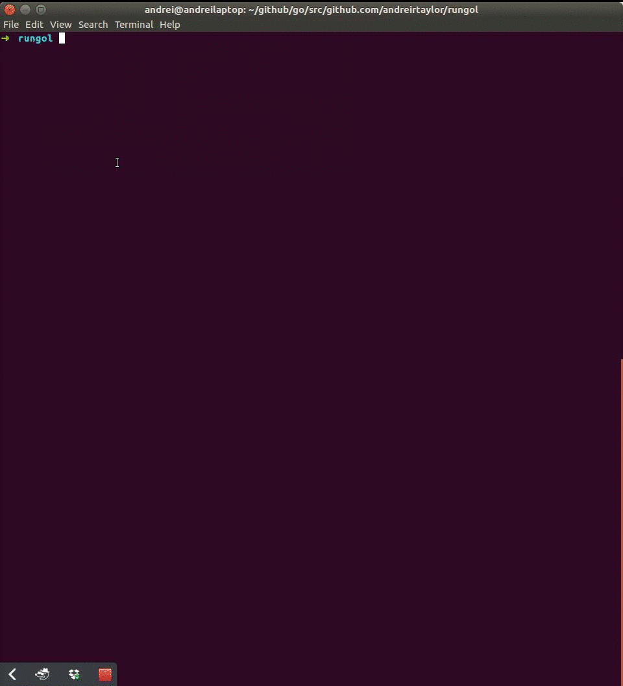

# Game of Life

A dumb implementation of Conways game of life to teach me about go



## To Use

```go
package main

import "github.com/andreirtaylor/gol"

func main() {
	gol.NewGame(60, 60).
		RunEvery(1)
}
```

## Functions

`NewGame` Generates a randomly populated board of size w x h

`Advance` Advance the game one step

`RunEvery` Synchronous advancing of the game every s seconds

## Notes

Dont hate, this is my first time using go. I'm not claiming to be an expert.

If I get around to it this is intended to be the library implementation of 
a Polymer based web app.
